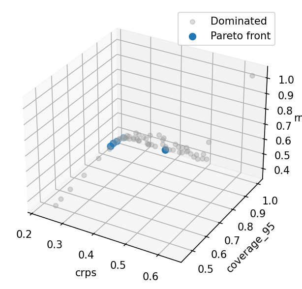
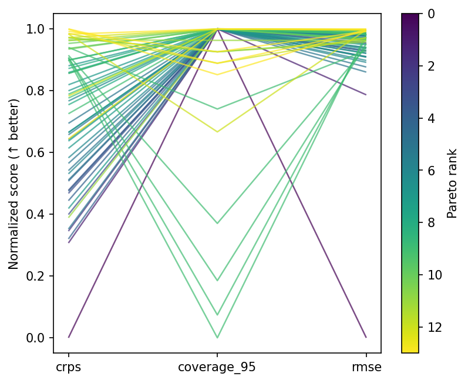
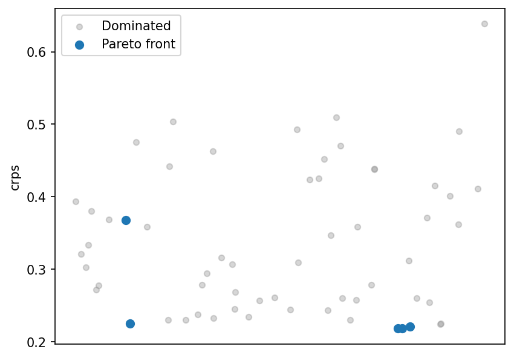
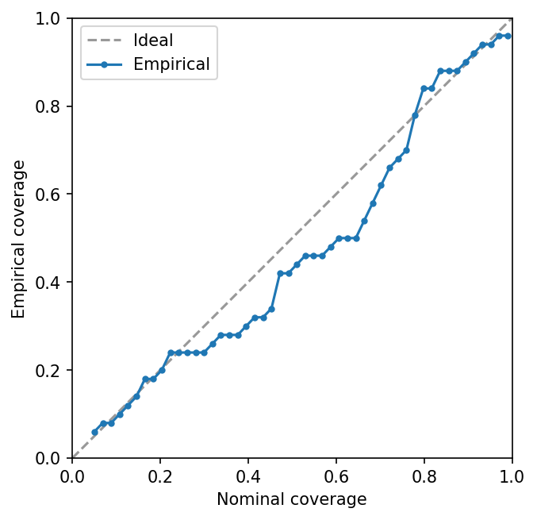

# Bayesian Model Criticism

This tutorial walks through a **scoring-and-stacking** workflow for
Bayesian models.  It demonstrates the features that set `trade-study`
apart from conventional hyperparameter optimizers: proper scoring
rules, calibration assessment, and score-based model averaging.

The underlying model is a conjugate Bayesian linear regression — no
MCMC sampler or external probabilistic programming library needed,
only numpy.

!!! tip "Run it yourself"

    The full runnable script is at
    [`examples/bayesian_study.py`](https://github.com/jcm-sci/trade-study/blob/main/examples/bayesian_study.py).

    ```bash
    uv run --extra examples python examples/bayesian_study.py
    ```

## The problem

We want to fit a Bayesian regression
$y = a + bx + \varepsilon$
where $\varepsilon \sim \mathcal{N}(0,\sigma_\text{true}^2)$ and the
true coefficients are known ($a=2$, $b=3$, $\sigma_\text{true}=0.5$).

The design question is: **which prior hyperparameters and sample sizes
produce well-calibrated, accurate posteriors?**  Specifically, each
configuration controls three knobs:

| Factor | Meaning |
|--------|---------|
| `prior_var` | Variance of the Normal prior on $(a, b)$ |
| `noise_scale` | Assumed observation noise $\sigma$ (may disagree with truth) |
| `n_obs` | Number of training observations |

Choosing `noise_scale` too small produces overconfident posteriors;
too large gives conservative intervals.  A tight prior (`prior_var`
small) biases the coefficients toward zero.  More data always helps,
but at a computational cost.

## Ground-truth model

```python
--8<-- "examples/bayesian_study.py:model"
```

## Conjugate posterior

Because we use a Normal prior with known noise variance, the
posterior over regression coefficients is available in closed form.
Given design matrix $\mathbf{X}$ and prior precision
$\boldsymbol{\Lambda}_0 = \sigma_\text{prior}^{-2}\mathbf{I}$:

$$
\boldsymbol{\Sigma}_n
  = \left(\boldsymbol{\Lambda}_0
    + \frac{\mathbf{X}^\top\mathbf{X}}{\sigma^2}\right)^{-1}
\qquad
\boldsymbol{\mu}_n
  = \boldsymbol{\Sigma}_n
    \frac{\mathbf{X}^\top\mathbf{y}}{\sigma^2}
$$

We draw posterior predictive samples by projecting coefficient draws
through the test design matrix and adding observation noise.

```python
--8<-- "examples/bayesian_study.py:posterior"
```

## Simulator and scorer

The **simulator** generates training data from the true model, fits
the conjugate posterior, and returns posterior predictive samples at
held-out test locations.  The **scorer** evaluates three complementary
metrics:

- **CRPS** (Continuous Ranked Probability Score) — a proper scoring
  rule that rewards sharp, well-calibrated predictive distributions.
- **Coverage (95 %)** — the fraction of test points whose true value
  falls inside the 95 % posterior predictive interval.
- **RMSE** — root mean squared error of the posterior mean.

```python
--8<-- "examples/bayesian_study.py:world"
```

## Observables and factors

Coverage is given lower weight (0.5) because a model can trivially
achieve 100 % coverage by being very wide; CRPS already penalises
that.

```python
--8<-- "examples/bayesian_study.py:observables"
```

```python
--8<-- "examples/bayesian_study.py:factors"
```

## Annotations

An `Annotation` attaches external metadata — here, a simple linear
cost model for the number of observations:

```python
--8<-- "examples/bayesian_study.py:annotation"
```

## Factor screening

Before running the full grid, Morris screening identifies which
factors influence the scores most.  `reduce_factors` drops any
factor whose $\mu^*$ falls below a threshold:

```python
--8<-- "examples/bayesian_study.py:screening"
```

## Grid evaluation

A 60-point Latin hypercube covers the three-factor space.  `run_grid`
evaluates every configuration and collects scores and annotations into
a `ResultsTable`:

```python
--8<-- "examples/bayesian_study.py:run"
```

## Pareto analysis

```python
--8<-- "examples/bayesian_study.py:results"
```

### Pareto front scatter matrix



With three objectives the front is a surface; `plot_front` shows all
pairwise projections.  Models with low CRPS generally have good
coverage and low RMSE, but there are trade-offs when noise is
mis-specified.

### Parallel coordinates



Front designs cluster at moderate prior variance and noise scales
close to the true value — the region where the model is neither
overconfident nor excessively vague.

### CRPS strip plot



## Score-based stacking

`stack_scores` finds simplex-constrained weights that minimise the
composite MSE across test points.  The stacked ensemble often beats
every individual model because it smooths over prior mis-specification:

```python
--8<-- "examples/bayesian_study.py:stacking"
```

## Calibration assessment

`coverage_curve` evaluates empirical coverage at many nominal levels.
A well-calibrated model tracks the diagonal:

```python
--8<-- "examples/bayesian_study.py:calibration"
```



## Persistence

`save_results` writes the `ResultsTable` to disk; `load_results`
reconstructs it.  Useful for expensive studies where you want to
separate evaluation from analysis:

```python
--8<-- "examples/bayesian_study.py:persistence"
```

## Multi-fidelity workflow

Real-world studies often have an expensive simulator — full MCMC, a
fine-mesh CFD solver, or an agent-based epidemiological model.
Running every candidate design at full fidelity is wasteful.  A
multi-fidelity strategy screens many designs cheaply, then validates
only the promising ones at high fidelity.

`Phase` supports this via optional `world` and `scorer` overrides.
When set, a phase uses its own simulator instead of the `Study`-level
default.  Here the cheap surrogate draws only 50 posterior samples
(fast but noisy CRPS estimates), while the validation phase draws
2 000:

```python
--8<-- "examples/bayesian_study.py:multifidelity"
```

The `Study` orchestrates both phases: the first screens 60 designs
with the cheap surrogate and keeps the top 10 by Pareto rank, then
the second re-evaluates those 10 designs with the expensive model.

This pattern applies whenever fidelity is a computational strategy
rather than a design factor:

- **Epidemiology** — screen surveillance designs with a deterministic
  ODE model, validate the best with a stochastic agent-based model.
- **Engineering** — coarse mesh for broad exploration, fine mesh for
  the Pareto front.
- **Forecast model grading** — fast approximate inference for
  screening, full HMC for final assessment.

## What to try next

- Swap `method="morris"` for `method="sobol"` in `screen()` for
  variance-based sensitivity indices.
- Use `Constraint` + `feasibility_filter` to enforce
  `coverage_95 >= 0.90` before stacking.
- Try `stack_bayesian()` on models that expose log-likelihood
  (requires `arviz`).
