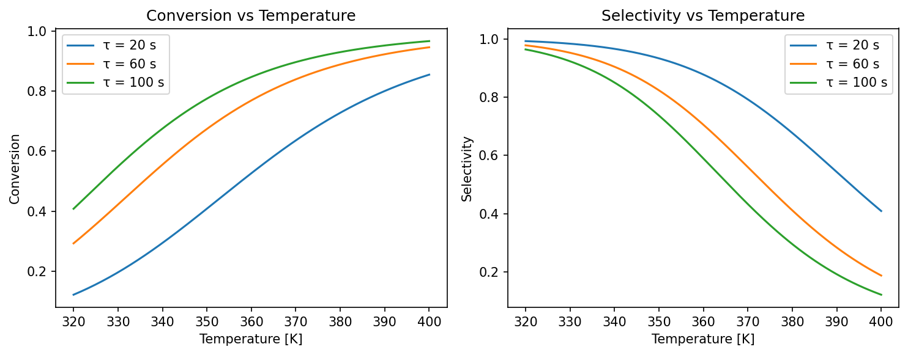
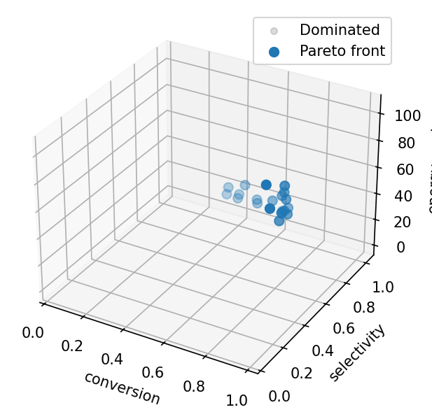
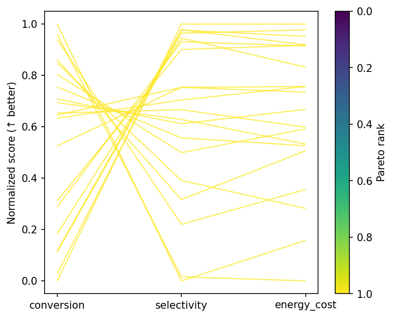
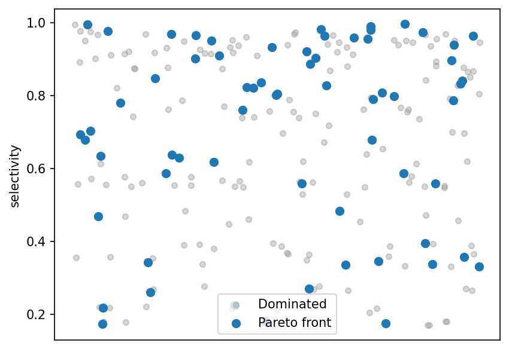

# Reactor Design Study

This tutorial walks through a **multi-phase trade study** for a
continuous stirred-tank reactor (CSTR) with competing objectives.
The reactor model uses closed-form Arrhenius kinetics — no dependencies
beyond numpy.

!!! tip "Run it yourself"

    The full runnable script is at
    [`examples/cstr_study.py`](https://github.com/jcm-sci/trade-study/blob/main/examples/cstr_study.py).

    ```bash
    uv run python examples/cstr_study.py
    ```

## The problem

A **continuous stirred-tank reactor** (CSTR) is a standard unit
operation in chemical engineering.  Reactants flow in continuously, mix
perfectly inside the vessel, and products flow out at steady state.

We model two series reactions:

$$A \xrightarrow{k_1} B \xrightarrow{k_2} C$$

where **B** is the desired product and **C** is an unwanted byproduct.
Each rate constant follows the Arrhenius law:

$$k_i = A_i \exp\!\left(-\frac{E_{a,i}}{R\,T}\right)$$

At steady state, the CSTR mass balance gives the exit concentrations:

$$C_A = \frac{C_{A,\text{in}}}{1 + k_1 \tau}, \qquad
  C_B = \frac{k_1 \tau \, C_{A,\text{in}}}{(1 + k_1 \tau)(1 + k_2 \tau)}$$

where $\tau$ is the mean residence time. From these we define:

- **Conversion**: $X = 1 - C_A / C_{A,\text{in}}$ — fraction of A
  consumed (higher is better).
- **Selectivity**: $S = C_B / (C_{A,\text{in}} - C_A)$ — fraction of
  converted A that became the *desired* product B (higher is better).
- **Energy cost**: $0.01(T - 300)^2 + 5 \dot{V}_c$ — a simplified
  model of heating plus coolant pumping costs (lower is better).

### Why the objectives conflict

Raising the reactor temperature increases $k_1$ (better conversion),
but also accelerates the unwanted $B \to C$ reaction because
$E_{a,2} > E_{a,1}$, which *hurts* selectivity.  Meanwhile, both heating and
cooling cost energy.  There is no single set of operating conditions
that simultaneously maximizes conversion and selectivity while
minimizing cost — the solutions lie on a **Pareto front**.

The kinetics plot below shows this conflict directly.  Conversion rises
monotonically with temperature, but selectivity peaks and then falls
as the consecutive $B \to C$ reaction accelerates:



## Ground-truth model

The code below implements the steady-state equations as a pure Python
function.  Because the model is closed-form, every evaluation takes
microseconds — ideal for demonstrating `trade-study` without waiting
for expensive simulations.

```python
--8<-- "examples/cstr_study.py:kinetics"
```

## Simulator and scorer

`trade-study` uses two protocols:

- A **Simulator** produces `(truth, observations)` pairs — here, the
  truth is the exact steady-state output and the observations add 2 %
  Gaussian noise to simulate real measurement uncertainty.
- A **Scorer** extracts the objective values that will populate the
  results table.

```python
--8<-- "examples/cstr_study.py:world"
```

## Define observables and factors

**Observables** declare *what* we measure and which direction is better.
Each one becomes a column in the results table.

```python
--8<-- "examples/cstr_study.py:observables"
```

**Factors** declare *what we can control* — here, four continuous
operating parameters with physical bounds:

```python
--8<-- "examples/cstr_study.py:factors"
```

## Constraints

Hard feasibility bounds can be defined with `Constraint` objects.
`feasibility_filter` builds a phase filter that drops designs
violating any constraint:

```python
--8<-- "examples/cstr_study.py:constraint"
```

## Factor screening

Before committing to a full grid sweep, Sobol screening identifies
which factors influence the objectives most:

```python
--8<-- "examples/cstr_study.py:screening"
```

## Build the study phases

A `Study` chains multiple **Phases**.  Phase 1 explores the design space
broadly with a 60-point Latin hypercube.  The `top_k_pareto_filter(20)`
callback selects the 20 best designs (by Pareto rank) and passes them to
Phase 2.  Phase 2 re-evaluates those 20 designs for confirmation (with
fresh noise draws), acting as a validation step.

```python
--8<-- "examples/cstr_study.py:phases"
```

## Run and inspect results

Create a `Study`, call `.run()`, and then query results per phase:

```python
--8<-- "examples/cstr_study.py:run"
```

The results include the Pareto front, per-design scores, and the
**hypervolume indicator** — a single number summarizing how well the
front covers the objective space (higher is better):

```python
--8<-- "examples/cstr_study.py:results"
```

### Pareto front scatter matrix



With three objectives the front is a surface; `plot_front` shows all
pairwise projections.  The conversion–selectivity panel is the
classic Pareto trade-off curve.

### Parallel coordinates



Each line is one reactor configuration, coloured by Pareto membership.
Front designs cluster at moderate temperatures and longer residence
times — the operating region where conversion and selectivity are
both reasonable.

### Selectivity strip plot



Scores for each design, split by Pareto status.  Front members span
the full selectivity range, reflecting different points along the
conversion–selectivity trade-off.

## What to try next

- Call `stack_bayesian()` on the Pareto front to compute model-averaging
  weights.
- Save results with `save_results()` for later analysis.
- Combine `feasibility_filter` with `top_k_pareto_filter` across
  successive phases for constrained multi-objective optimisation.

## Progress callbacks and parallel execution

`run_grid` accepts a `callback` for progress reporting and `n_jobs`
for parallel execution via joblib:

```python
--8<-- "examples/cstr_study.py:callback"
```

## Adaptive exploration

When the design space is too large for a grid sweep, use
`Phase(grid="adaptive")` for optuna-driven multi-objective
Bayesian optimisation.  The `factors` argument on `Study` provides
the parameter bounds:

```python
--8<-- "examples/cstr_study.py:adaptive"
```

## Feasibility-constrained phases

Use `feasibility_filter` as a phase filter to enforce hard
constraints before passing designs to subsequent phases:

```python
--8<-- "examples/cstr_study.py:feasibility"
```
