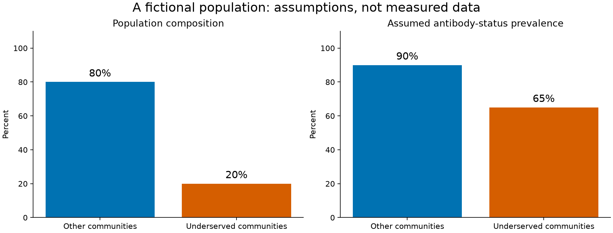
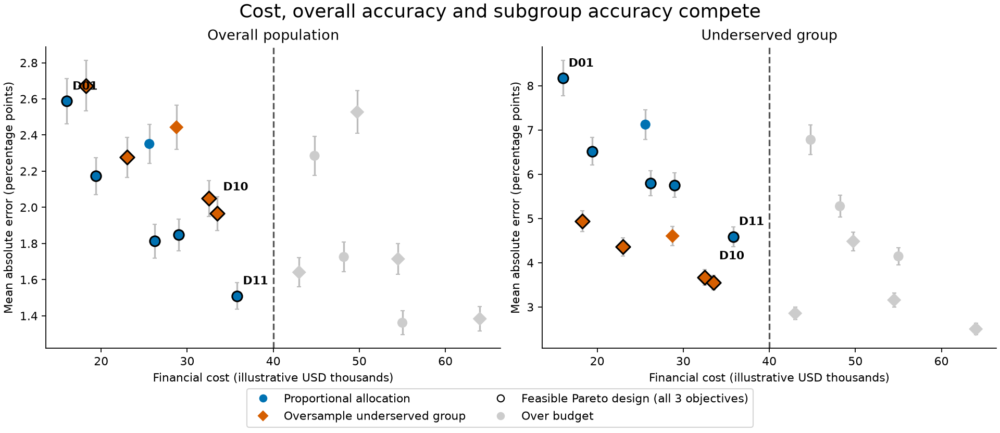
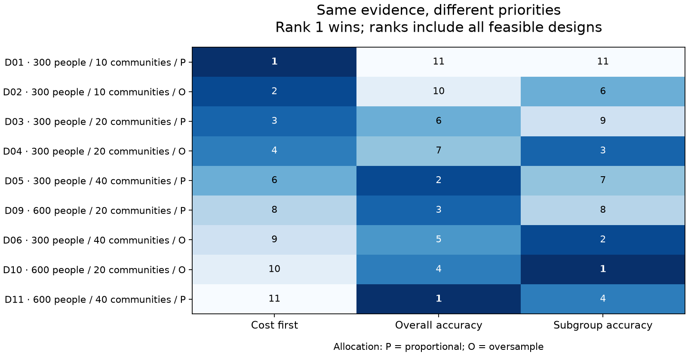
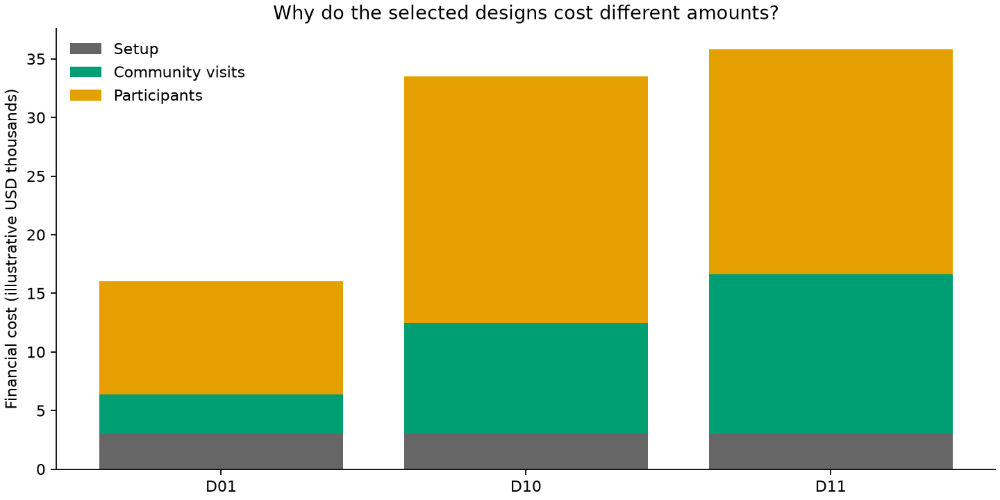

# How much survey is enough—and whose uncertainty matters?

This notebook is a 15-minute demonstration for a mixed audience at the
Johns Hopkins International Vaccine Access Center (IVAC). It compares
serosurvey designs using financial cost, overall estimation accuracy and
accuracy for an underserved group. All populations, prevalences, prices
and preference weights are hypothetical.

Open the executed
[Jupyter notebook](https://github.com/jcm-sci/trade-study/blob/main/examples/serosurvey_study.ipynb)
to read the narrative, code, tables and saved figures. The accompanying
[Python script](https://github.com/jcm-sci/trade-study/blob/main/examples/serosurvey_study.py)
contains the simulator and plotting helpers and regenerates these figures.
Use both files from a checkout; the notebook imports the companion module.

## Run or present the notebook

From the repository root:

```bash
uv run --extra notebook jupyter lab examples/serosurvey_study.ipynb
```

Choose the environment's Python kernel, then restart it and run all cells.
The `notebook` extra supplies JupyterLab, nbconvert, pandas, matplotlib
and Pareto analysis without requiring the other optional modeling backends.
Installation needs network access; the executed example uses only local
code and synthetic data. Run from a checkout of `main`: the notebook uses
the preference API added after the 0.3.0 release.

Clean notebook executions took about six to eight seconds on the development
machine, including kernel startup and rendering. The companion script took
about two seconds for 19,800 evaluations and four figures. These measurements
exclude dependency installation; check your presentation machine before the talk.

Saved notebook outputs provide a fallback without running code. Export them
to HTML for an additional presentation copy:

```bash
uv run --extra notebook jupyter nbconvert --to html examples/serosurvey_study.ipynb
```

To verify execution in a fresh kernel without modifying the saved notebook:

```bash
uv run --extra notebook jupyter nbconvert --execute --to notebook \
  --ExecutePreprocessor.timeout=60 --output serosurvey_executed.ipynb \
  --output-dir /tmp examples/serosurvey_study.ipynb
```

## The decision

IVAC's [SISS project](https://publichealth.jhu.edu/ivac/our-work/strengthening-immunization-systems-through-serosurveillance-siss)
examined the design and use of serological surveillance. The
[serosurvey costing study by Carcelen, Patenaude, Moss and colleagues](https://pmc.ncbi.nlm.nih.gov/articles/PMC7561102/)
provides a concrete link between epidemiology and economic evaluation.
Its study-, cluster- and participant-level cost structure motivates this
example; we do not reproduce its study or use its historical prices.

The fictional population consists of an 80% group and a 20% underserved
group, with antibody-status prevalences of 90% and 65% respectively.
These are assumed model inputs, not measured data or protection thresholds.



Compare 18 designs:

| Factor | Levels |
|---|---|
| Participants | 300, 600, 1,200 |
| Communities | 10, 20, 40 |
| Allocation | Proportional 80:20, or oversampling 50:50 |

Allocation applies to both participants and communities. Within each group,
participants are distributed as evenly as possible, keeping exact totals.
Independent community probabilities follow a Beta distribution centered on
the group mean, with illustrative within-community correlation 0.06;
participant counts then follow a binomial model. The estimand is the fixed
group mean, not the realized mean in the sampled communities.

The overall prevalence estimator uses population weights of 80:20 for both
allocation strategies. Oversampling does not change the population composition.
Financial cost is fixed setup plus community visit costs plus participant costs.
Average per-community and per-participant costs are not added together as if
they were independent marginal costs.

## Run, aggregate and refine

The notebook visibly constructs a `Study` with two grid `Phase`s: 100 simulated
surveys per design, followed by 1,000 per design with an independent phase seed.
Both phases evaluate all 18 designs. Refinement increases simulation replication,
not the number of participants per survey. The refined estimates replace the
screening estimates; the two phases are not pooled.

Each scorer call returns financial cost and absolute prevalence errors in
percentage points. `aggregate_replicates()` averages those errors, producing
mean absolute error (MAE), and retains their Monte Carlo variation. Averaging
signed errors before taking their absolute value would measure something different.

## Inspect feasible alternatives

A `Constraint` imposes an illustrative $40,000 financial budget. The Pareto
set minimizes cost, overall MAE and underserved-group MAE simultaneously.
Subgroup error is a narrow measure of information equity, not a comprehensive
measure of equity in health outcomes.



Gray designs exceed the budget. Outlines show the feasible Pareto set computed
using all three objectives; the two panels are projections, not independently
computed two-objective fronts. Design labels identify the preference winners.
Vertical bars are approximately two Monte Carlo standard errors of estimated
MAE. They express simulation precision under this model, not uncertainty in a
real survey's prevalence or the model assumptions. They are marginal bars,
not simultaneous post-selection confidence guarantees.

## Change priorities without rerunning simulations

The notebook passes the raw results to `preference_sweep()` with three explicit
preference vectors and `normalization="reference"`. Fixed reference ranges are
$0–70,000, 0–4 percentage points overall MAE, and 0–10 percentage points subgroup
MAE. These anchors scale preferences; they are not feasibility thresholds and
do not clip values. Scenario weights are hypothetical, not elicited stakeholder values.



Rank 1 wins within a scenario. The displayed rows are feasible Pareto designs,
but ranks include all feasible designs. Choices depend on point estimates and
can change with further simulation or different assumptions. Any reported
selection fraction describes the supplied preference scenarios, not a probability
that a design is best.

For a short live interaction, change the budget to $30,000 in the decision
cell and rerun that cell and the figures below it. Restore the budget and edit
the subgroup-priority weights to compare another preference. No simulation
rerun is needed. If the budget admits no alternative, the example reports no choice.

The optional cost breakdown in the appendix supports an economics discussion:



## A 15-minute presentation

| Minutes | Content |
|---|---|
| 0–2 | The decision and the two population groups |
| 2–4 | Design factors and competing objectives |
| 4–6 | One visible `Study` definition and a live run |
| 6–10 | Budget and Pareto plots |
| 10–12 | Priorities and an optional budget change |
| 12–13 | Assumptions a real project would replace |
| 13–15 | Discussion |

The notebook includes presenter notes and slideshow cell metadata. Leave the
model details and cost breakdown as appendices for the main talk. The saved
notebook and HTML export make a Beamer build unnecessary for the current
fast-running example.

## What a real project would replace

Replace the synthetic population with context-specific prevalence, clustering,
nonresponse and sampling-frame assumptions; add validated assay characteristics
and uncertainty; use local financial and economic costs; and define objectives
and practical constraints with stakeholders. The example holds assay effects
fixed and does not equate antibody-status prevalence with complete protection.
Communities are sampled without selection bias by construction. Real selection
and nonresponse can introduce bias that more simulation cannot remove.

The source notebook links the IVAC projects and member profiles that informed
its scope. Those connections do not imply endorsement of the example.

To regenerate documentation figures:

```bash
uv run --extra notebook python examples/serosurvey_study.py
```
